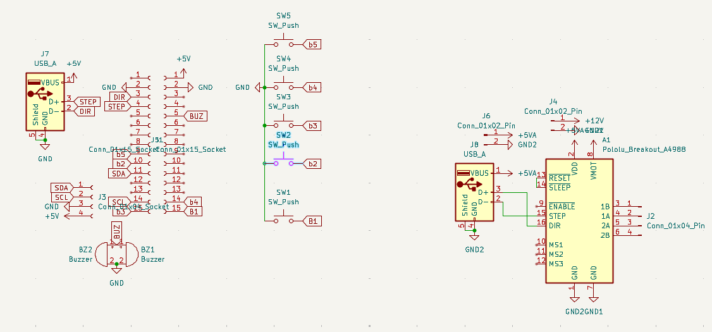
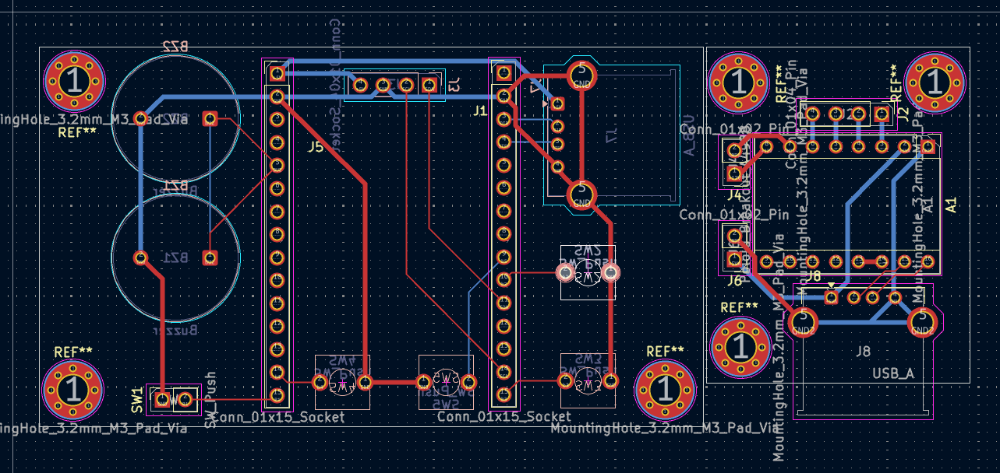

# Alarm Clock

Hello\
this is my alarm clock.\
its gonna fuction just like a normal alarm clock, with the difference being that it also opens my curtains every morning so I dont have to keep waking up in the dark.

It will use a stepper motor to do this with an esp to be the clock. It will have a nice interactive UI on an ssd1306 oled screen and  can be turned off with either a motion sensor or a big red button(I havent decided)

## 24th of May

Okay time to make all the cool stuff.\

Schematic here:

PCB here:

this is kinda just a basic arduino circuit for the most part.\
there are 2 pcbs for 2 main sections:\
1. the esp section with the sensors, buzzers, etc.
2. the section connected to the battery and stepper motor.

I use a buck coverter to step the 12V voltage down to 5V and then send it through a USBA-A cable, along with the step and direction pins of the stepper to the esp side where it feeds into the circuit.\
I did it like this so that I could pick up and move around the esp side a bit without disturbing the stepper side which would be connected to my curtains.\
This is actually kinda fun and I hope this works out nicely.

Time spent: 4 hours
