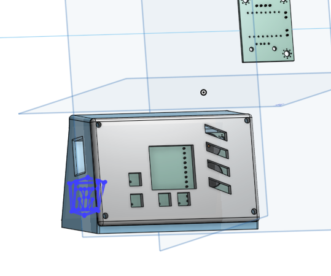
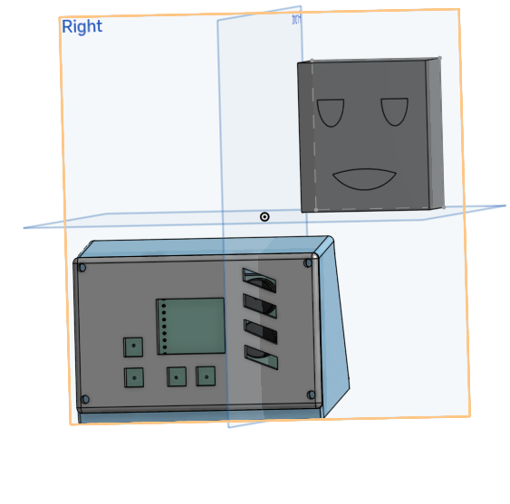
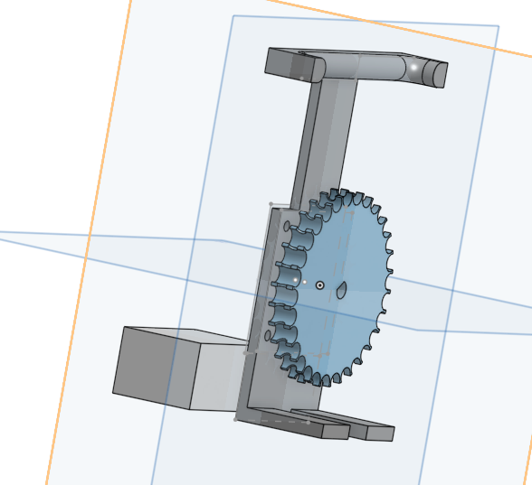

# Alarm Clock

Hello\
this is my alarm clock.\
its gonna fuction just like a normal alarm clock, with the difference being that it also opens my curtains every morning so I dont have to keep waking up in the dark.

It will use a stepper motor to do this with an esp to be the clock. It will have a nice interactive UI on an ssd1306 oled screen and  can be turned off with either a motion sensor or a big red button(I havent decided)

## 24th of May

Okay time to make all the cool stuff.\

Schematic here:

PCB here:

this is kinda just a basic arduino circuit for the most part.\
there are 2 pcbs for 2 main sections:\
1. the esp section with the sensors, buzzers, etc.
2. the section connected to the battery and stepper motor.

I use a buck coverter to step the 12V voltage down to 5V and then send it through a USBA-A cable, along with the step and direction pins of the stepper to the esp side where it feeds into the circuit.\
I did it like this so that I could pick up and move around the esp side a bit without disturbing the stepper side which would be connected to my curtains.\
This is actually kinda fun and I hope this works out nicely.

Time spent: 4 hours

## 27th of May

Finally got time to work on it and now im gonna do some cool stuff. 

So i made some of the case and got an outer shell done. it looks nice and also made a cutout for the buzzers.\
next im gonna make the screen hole and button holes and also edit the pcb to have hackable pins and a spot for a dht22 for temp checking.

for the case i made a trapezoid, extruded it out, shelled it, extruded the walls like 6mm and added heatset holes. finally ended with a panel on the front to cover it up.\
basic shape done. pretty easy\

next import the pcb, and move case around it so it lines up.\
make a nice sound grate thingy with way too overcomplicated sketches and line art for what the final product ends up being.\
be sad because period ends and you cant work on it anymore.

Time spent: 1 hr

## 28th of May

hello again

today i did a lot of cool stuff.

First: i nearly finished the case with just the stepper mechanism left to go.\
next i and completely done with the pcb and allat and also made a logo in 20 mins cuz why not + it looks pretty cool.

Second: uhh thats basically all i did so here are some photos of it all.

Time spent: 4 hours
## 29th of May

Hi

Today i experienced true pain\
First i worked a little on my case. nothing special really.\
what happened next is what broke me.\
So i started firmware today and spent like 2 hours or so on it. i left my computer on when i went to dinner and when i came back, the battery died.\

I forgot to save anything.\
2 hours down the drain.

Anyways i rewrote it all after that but it was painful.

hours spent: 4

## 30th of May

Today im finally done with all the cad. the pcb should be done, might add some more art but in terms of technical stuff, its done.\
For the remaining cad today, I spent time making the gear that opens/closes my curtains. As well as a straightener for the chain since its a bit loose and need to be at an angle to be stretched out. otherwise it might derail.

I need to make the repo and finish up firmware now.

Hours spent: 4
