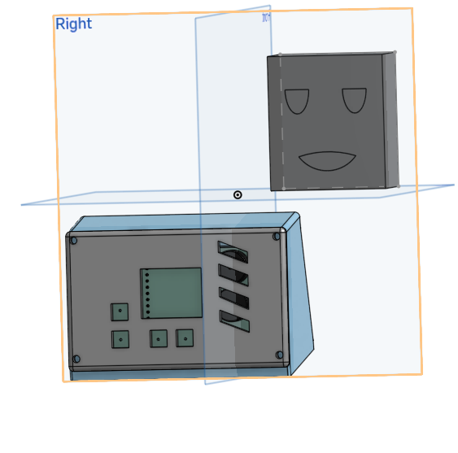

# Curtain Manager Alarm Clock

Hello there. This project is an alarm clock that opens and closes my curtains for me because im too lazy to open them myself.
  

## Why I made this

This project came to mind after the 3rd day in a row I was unbothered to open my curtains in the morning and came home to a dark room.(darkness is scary)\
What? you expected some deep reason with an emotional backstory?\
Well too bad, everything I make is on a whim, boredom, or for the funnies.

## What this does

This is an alarm clock(shocker I know) that opens my curtains when it goes off.\
It has the following features:\

- Alarm Clock(You could have never guessed)
- Outside weather
- Inside weather
- Customisable Ring tone
- Opens Curtains for you

It is made up of 3 main sections:

- The Motor
- The Alarm body
- The Off Button

### The Motor
The motor I used for this is a NEMA17 Stepper and I designed a frame and gear for the motor to pulled my beaded curtain string.\
I chose this motor for 3 main reasons:

- The curtain is quite heavy and I dont believe a 5V motor could pull that much weight
- This stepper is quite cheap and I have used it before with it being simple to use.
- Steppers are cooler than 5V motors

I use a PCB to connect it to an A4988 stepper motor driver. This driver simplifies the firmware and wiring needed to control the motor.\
I also put a Buck Coverter inside because the stepper requires 12V whereas the alarm body needs 5, so the step down from a 12V power supply is what I felt would be easiest.\
If you want to use any other methods, it should be pretty easy to do.

### The Alarm Body

The alarm body features a 3d printed body, OLED SSD1306 128X64 Screen to view the current time, set alarm time, and view the weather. It also has 4 buttons that you czn use to change the time and do other cool programable things.

Inside there are

- 4 Buttons
- An SSD1306 OLED screen
- An ESP32
- An RTC
- 2 Buzzers
- A DHT22 sensor

The Alarm Body and the Motor are connected through a USBA-A cable as that allows for power transmission and for the 2 datalines for the stepper to transmit between the 2 modules in one clean cable.

### The Off Button

The off Button connects to the Alarm Body with wires and can be placed basically anywhere.\
I personally like to use a big red button but if you wish to use something else like a motion sensor, I have left the pins available to use so that it is possible to use either option with no change to the firmware.

Why no snooze button?

Snooze buttons are for losers. If your alarm goes off, get your ass out of bed.

## How to make it

Wow you also wanna make this. I am honoured to hear that.

First thing you wanna do is download the cad folder and get all those files printing.

This is the anoying part

I made this part to fit my own curtains. You will have to edit it to fit your own curtains. Everything else should be kept the same.

Order all the parts and the pcb. Once they arrive, you can get to soldering it all together. I will include photos of the finished version once I build it myself so you have a reference.

You need to put 3 heatsets per pcb and then 4 for the front panel of the Alarm Body.

The button connects via wires going through the back hole. the placement of the USBA hole is hopefully correct, If not, I can just change it.

After that you can flash the esp with firmware listed in the firmware folder(WIP FOR NOW) and screw everything in.

